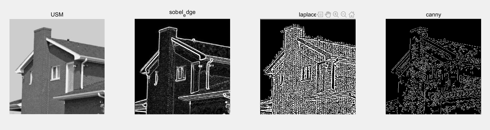

 
 
# 数字图像处理课程作业实验四 

**张程博昊**

**自动化64**

**2160504106**

**2019年3月18日**

 

## 摘要

这次实验实验主要采用了各种滤波器处理方法，实验环境为MATLAB。使用其中函数，完成了对附件中图像进行高斯滤波、中值滤波等功能。并自行编写高斯滤波器和USM、sobel dege detector、Laplace edge detection；Canny algorithm等滤波器算法。
 

## 实验内容

### 1.空域滤波器：分别用高斯滤波器和中值滤波器去平滑测试图像test1和2，模板大小分别是3x3 ， 5x5 ，7x7； 分析各自优缺点；

采用MATLAB中的fspecial（）、imfilter（）、medfilt2（）等函数对图像滤波，得出结果如下：

**结果分析：**

### 2.利用固定方差 sigma=1.5产生高斯滤波器. 附件有产生高斯滤波器的方法； 分析各自优缺点；

直方图均衡化是指将原图像采取某种变换，得到一幅灰度直方图为均匀分布的新图像的方法，这样增加了像素灰度值的动态范围，从而达到增强图像整体对比度的效果。在MATLAB中可以采用histeq()函数对图像进行直方图均衡操作。

 
 
 

**改善内容：**
通过对比图像均衡前后的图像可以看出经直方图均衡后的图像对比度更高。

 

### 3.利用高通滤波器滤波测试图像test3,4：包括unsharp masking, Sobel edge detector, and Laplace edge detection；Canny algorithm.分析各自优缺点；

直方图匹配又称为直方图规定化，是指将一幅图像的直方图变成规定形状的直方图而进行的图像增强方法。可以采用imhist()函数，并采取原图像为模板。得到结果如下：

 
 
 
 
 
  
 
 

## 附录

代码详见文件

 

## 参考文献

[1] 冈萨雷斯, 数字图像处理（第三版）, 电子工业出版社
